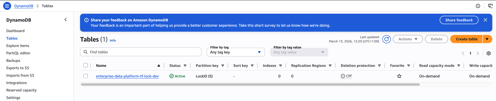

# Terraform Bootstrap

This repository is part of the [Enterprise Data Platform](https://github.com/enterprise-data-platform-emeka/platform-docs). For the full project overview, architecture diagram, and build order, start there.

---

This is the first repository I run before anything else in the Enterprise Data Platform. It does two things: creates the remote storage that Terraform uses to track what infrastructure it has already created, and sets up the GitHub Actions IAM (Identity and Access Management) authentication that every CI/CD workflow in the platform needs to talk to AWS.

Nothing else in this project can be built until this exists.

---

## Why this has to come first

Terraform (an infrastructure-as-code tool) keeps a record of every resource it creates in a file called `terraform.tfstate`. Think of this file like a receipt. Every time Terraform creates an S3 (Simple Storage Service) bucket or a DMS (Database Migration Service) replication instance, it writes that down. Next time I run Terraform, it reads that receipt and compares it against what I want, so it only creates or changes what is different.

By default, Terraform stores this receipt file on my local machine. That is a problem for a few reasons:

- If my laptop breaks or gets reformatted, the state file is gone and Terraform has no idea what it already created
- If I switch computers, the state file is not there
- If someone else ever works on this project, they have no state file and Terraform thinks nothing exists

The solution is to store the state file remotely in an S3 bucket. That way it is always accessible, versioned, encrypted, and safe.

I also use DynamoDB (Amazon's NoSQL key-value database) as a lock. If two Terraform commands ever run at the same time against the same environment (which could corrupt the state file), DynamoDB prevents the second one from starting until the first finishes.

This bootstrap repository creates that S3 bucket and that DynamoDB table. Once they exist, all other Terraform in this project stores its state there.

---

## Why dev, staging, and prod are separate

I run this bootstrap process once per AWS account. I have three accounts: dev, staging, and prod. Each one gets its own state bucket and its own lock table.

The reason for separation is isolation. If something goes wrong in dev (a bug, an experimental change, a cost spike), it cannot affect staging or prod in any way. Each account is an independent boundary. Dev state cannot overwrite prod state because they live in completely different S3 buckets in completely different AWS accounts.

---

## Repository structure

```
terraform-bootstrap/
│
├── versions.tf                      Locks Terraform and AWS provider versions
├── .gitignore                       Prevents sensitive files from being committed
├── README.md                        This file
│
├── modules/
│   ├── state-backend/
│   │   ├── main.tf                  Creates the S3 bucket and DynamoDB table
│   │   ├── variables.tf             Input variables for the module
│   │   └── outputs.tf               Exports the bucket and table names
│   │
│   └── github-oidc/
│       ├── main.tf                  Creates the OIDC provider and IAM roles
│       ├── variables.tf             Input variables for the module
│       └── outputs.tf               Exports the provider ARN and role ARNs
│
└── environments/
    ├── dev/
    │   ├── main.tf                  Calls both modules (state-backend + github-oidc)
    │   ├── variables.tf             Dev-specific variables (region, profile, github_org)
    │   └── backend.tf               Remote backend config (starts commented out)
    │
    ├── staging/
    │   ├── main.tf
    │   ├── variables.tf
    │   └── backend.tf
    │
    └── prod/
        ├── main.tf
        ├── variables.tf
        └── backend.tf
```

---

## Root-level files

### versions.tf

This file locks the versions of Terraform and the AWS provider so the code behaves the same way every time it runs, on any machine.

```hcl
terraform {
  required_version = ">= 1.6.0"

  required_providers {
    aws = {
      source  = "hashicorp/aws"
      version = "~> 5.0"
    }
  }
}
```

The `required_version` line means Terraform 1.6.0 or higher must be installed. The `~> 5.0` for the AWS provider means any version in the 5.x range is fine, but version 6 would not be allowed. This protects against breaking changes in future provider releases.

### .gitignore

This file tells Git which files to never commit to the repository.

```
.terraform/
*.tfstate
*.tfstate.*
crash.log
.terraform.lock.hcl
.vscode/
.DS_Store
```

The most important entries are `*.tfstate` and `*.tfstate.*`. State files contain resource IDs, configuration details, and sometimes sensitive data. They must never be committed to version control.

---

## The state-backend module

This module is reusable. I call it from each environment (dev, staging, prod) with different input values. The module itself creates the same two resources every time: an S3 bucket and a DynamoDB table.

### variables.tf

```hcl
variable "bucket_name" {
  description = "S3 bucket name for Terraform state"
  type        = string
}

variable "dynamodb_table_name" {
  description = "DynamoDB table name for state locking"
  type        = string
}

variable "environment" {
  description = "Environment identifier"
  type        = string
}
```

These three variables are what make the module reusable. I pass different values when calling the module from dev vs staging vs prod.

### main.tf

**The S3 state bucket:**

```hcl
resource "aws_s3_bucket" "state" {
  bucket = var.bucket_name

  tags = {
    Environment = var.environment
    ManagedBy   = "Terraform"
    Project     = "EnterpriseDataPlatform"
  }

  lifecycle {
    prevent_destroy = true
  }
}
```

The `prevent_destroy = true` setting in the lifecycle block is critical. It means Terraform will refuse to delete this bucket even if I run `terraform destroy`. This is intentional - the state bucket is the foundation of everything. If I accidentally delete it, Terraform loses track of all infrastructure. I have to manually remove this protection if I ever genuinely want to destroy the bucket.

**Versioning:**

```hcl
resource "aws_s3_bucket_versioning" "versioning" {
  bucket = aws_s3_bucket.state.id

  versioning_configuration {
    status = "Enabled"
  }
}
```

With versioning enabled, S3 keeps every previous version of the state file. If a bad Terraform apply corrupts the state file, I can restore an earlier version of it.

**Encryption:**

```hcl
resource "aws_s3_bucket_server_side_encryption_configuration" "encryption" {
  bucket = aws_s3_bucket.state.id

  rule {
    apply_server_side_encryption_by_default {
      sse_algorithm = "AES256"
    }
  }
}
```

AES256 (Advanced Encryption Standard with 256-bit keys) encrypts every file stored in this bucket. The state file can contain resource IDs and configuration details, so encrypting it at rest is a basic security requirement.

**The DynamoDB lock table:**

```hcl
resource "aws_dynamodb_table" "locks" {
  name         = var.dynamodb_table_name
  billing_mode = "PAY_PER_REQUEST"
  hash_key     = "LockID"

  attribute {
    name = "LockID"
    type = "S"
  }

  tags = {
    Environment = var.environment
    ManagedBy   = "Terraform"
  }

  lifecycle {
    prevent_destroy = true
  }
}
```

When Terraform runs, it writes a lock record to this DynamoDB table before making any changes. If another Terraform process tries to run at the same time, it sees the lock and waits (or errors out). This prevents two applies from running simultaneously and corrupting the state file. `PAY_PER_REQUEST` means I only pay when the table is actually used, which for a lock table is almost nothing.

### outputs.tf

```hcl
output "state_bucket_name" {
  value = aws_s3_bucket.state.id
}

output "lock_table_name" {
  value = aws_dynamodb_table.locks.name
}
```

These outputs surface the bucket name and table name after deployment. I can reference these when configuring other Terraform projects to use this backend.

---

## The github-oidc module

This module creates everything GitHub Actions needs to authenticate with AWS without storing any long-lived credentials. It lives in bootstrap (not in `terraform-platform-infra-live`) for one important reason: the GitHub Actions IAM role must exist before the infra deploy workflow can run. If the role lived inside the infra repo, every new session would need a manual local apply to bootstrap authentication first. Keeping it here means it is always present, regardless of what the platform deploy cycle has created or destroyed.

The module creates two types of resources.

**The OIDC (OpenID Connect) provider:**

```hcl
resource "aws_iam_openid_connect_provider" "github" {
  url             = "https://token.actions.githubusercontent.com"
  client_id_list  = ["sts.amazonaws.com"]
  thumbprint_list = ["6938fd4d98bab03faadb97b34396831e3780aea1", "1c58a3a8518e8759bf075b76b750d4f2df264fcd"]

  lifecycle {
    prevent_destroy = true
  }
}
```

This is an AWS-side trust record. It tells the AWS account to trust JWT (JSON Web Token) tokens issued by GitHub's OIDC service at `https://token.actions.githubusercontent.com`. When a GitHub Actions workflow requests AWS credentials, GitHub issues a short-lived signed token. AWS verifies the signature against this provider and decides whether to grant the role.

The OIDC provider is account-scoped: one per AWS account. Staging and prod environments do not create a second one. The `prevent_destroy = true` protection means `terraform destroy` cannot remove it.

**The IAM roles (one per environment):**

```hcl
resource "aws_iam_role" "github_actions" {
  for_each = toset(["dev", "staging", "prod"])
  name     = "edp-${each.value}-github-actions-role"
  ...
  lifecycle {
    prevent_destroy = true
  }
}
```

Three roles are created: `edp-dev-github-actions-role`, `edp-staging-github-actions-role`, and `edp-prod-github-actions-role`. The deploy workflows in each platform repository reference the role by name and assume it via OIDC. The trust policy on each role restricts access to workflows running from the specific repositories listed in `github_repos` — no other repo can assume the role.

Each role has `AdministratorAccess`. This is intentional because the Terraform apply workflows need to create, modify, and delete resources across every AWS service. Least-privilege is enforced at the trust layer (OIDC conditions that scope to specific repos and the GitHub org) rather than the permission layer.

All three roles also use `prevent_destroy = true` for the same reason as the OIDC provider: if they are accidentally destroyed, every CI/CD workflow in the platform breaks instantly.

---

## Environment configuration

Each folder inside `environments/` is a standalone Terraform configuration. Terraform only reads files in the current directory, so I have to navigate into the right environment folder before running any commands.

### environments/dev/variables.tf

```hcl
variable "aws_region" {
  type    = string
  default = "eu-central-1"
}

variable "aws_profile" {
  type    = string
  default = "dev-admin"
}
```

These tell Terraform which AWS region to use and which CLI (Command Line Interface) profile to authenticate with. The `dev-admin` profile corresponds to the SSO (Single Sign-On) profile I configured for the dev AWS account.

### environments/dev/main.tf

```hcl
provider "aws" {
  region  = var.aws_region
  profile = var.aws_profile
}

module "state_backend" {
  source = "../../modules/state-backend"

  bucket_name         = "enterprise-data-platform-tfstate-dev"
  dynamodb_table_name = "enterprise-data-platform-tf-lock-dev"
  environment         = "dev"
}

module "github_oidc" {
  source     = "../../modules/github-oidc"
  github_org = var.github_org
}
```

The `provider` block tells Terraform how to authenticate with AWS. The `state_backend` module call creates the S3 bucket and DynamoDB lock table. The `github_oidc` module call creates the OIDC provider and all three environment IAM roles. Only the dev environment calls `github_oidc` because the OIDC provider is account-scoped.

### environments/dev/backend.tf

This file starts commented out. This is intentional and important.

```hcl
# terraform {
#   backend "s3" {
#     bucket         = "enterprise-data-platform-tfstate-dev"
#     key            = "bootstrap/terraform.tfstate"
#     region         = "eu-central-1"
#     dynamodb_table = "enterprise-data-platform-tf-lock-dev"
#     profile        = "dev-admin"
#     encrypt        = true
#   }
# }
```

The reason it starts commented out: the S3 bucket and DynamoDB table do not exist yet when I first run Terraform. I cannot tell Terraform to store its state in a bucket that has not been created. So I apply with local state first (which creates the bucket), then uncomment this file and run `terraform init -reconfigure` to migrate the local state into the new S3 bucket.

### Staging and prod

The staging and prod environment folders follow the same pattern as dev. The only values that change are:

- `aws_profile` - `staging-admin` or `prod-admin`
- `bucket_name` - includes `staging` or `prod` in the name
- `dynamodb_table_name` - includes `staging` or `prod` in the name
- `environment` - `staging` or `prod`

---

## Full deployment procedure

Repeat these steps for each environment: dev first, then staging, then prod.

### Step 1 - Log in to AWS

```bash
aws sso login --profile dev-admin
```

This refreshes the temporary SSO (Single Sign-On) credentials for the dev account. SSO credentials expire after a few hours, so I always run this before any Terraform command.

### Step 2 - Navigate to the environment

```bash
cd terraform-bootstrap/environments/dev
```

### Step 3 - Initialize Terraform

```bash
terraform init
```

This downloads the AWS provider plugin and sets up the working directory. It reads the `versions.tf` file to know which provider to download.

### Step 4 - Apply

```bash
terraform apply
```

Terraform shows a plan of what it will create. I type `yes` to confirm. This creates:
- The S3 state bucket (`enterprise-data-platform-tfstate-dev`)
- The DynamoDB lock table (`enterprise-data-platform-tf-lock-dev`)
- The GitHub OIDC provider for the AWS account
- Three GitHub Actions IAM roles: `edp-dev-github-actions-role`, `edp-staging-github-actions-role`, `edp-prod-github-actions-role`

For staging and prod environments, only the state bucket and lock table are created. The OIDC provider and IAM roles are account-scoped and already exist from the dev apply.

At this point, state is stored locally in a `terraform.tfstate` file in the environments/dev folder.

### Step 5 - Enable remote state

Now that the S3 bucket exists, I can migrate state into it.

Open `environments/dev/backend.tf` and uncomment everything inside it.

Then run:

```bash
terraform init -reconfigure
```

Terraform detects the backend configuration has changed, reads the local state file, and uploads it to S3. From this point on, state is stored remotely. The local `terraform.tfstate` file is no longer used.

---

## What happens inside Terraform

It helps to understand what each Terraform command actually does:

**`terraform init`**
- Downloads the AWS provider plugin from the Terraform Registry
- Reads the backend configuration and connects to the remote state
- Registers any module paths

**`terraform plan`**
- Calls AWS APIs to check the current real state of resources
- Compares that against what the code describes
- Shows exactly what would be created, changed, or destroyed

**`terraform apply`**
- Runs the plan
- Calls AWS APIs to create or modify resources
- Writes the results to the state file

---

## Setting up AWS CLI SSO profiles

This section covers setting up the AWS CLI (Command Line Interface) to authenticate using IAM (Identity and Access Management) Identity Center, which is AWS's SSO (Single Sign-On) service. I use this instead of static access keys because SSO credentials are temporary and automatically rotated.

### Step 1 - Verify AWS CLI version

```bash
aws --version
```

The output must show `aws-cli/2.x.x`. Version 2 is required for SSO support.

### Step 2 - Create a shared SSO session

```bash
aws configure sso-session
```

When prompted:

```
SSO session name:   platform-session
SSO start URL:      https://d-xxxxxxxxxx.awsapps.com/start
SSO region:         us-east-1
SSO registration scopes: (press Enter for default)
```

The SSO start URL comes from the AWS IAM Identity Center console in the management account. This creates a shared session that all three profiles (dev, staging, prod) will use.

### Step 3 - Log in to the SSO session

```bash
aws sso login --sso-session platform-session
```

A browser window opens. I authenticate and click Allow. This creates a temporary token that is valid for a few hours.

### Step 4 - Configure the dev profile

```bash
aws configure sso --profile dev-admin
```

When prompted:

```
SSO session name: platform-session
(Select the dev AWS account from the list)
Role: AdministratorAccess
CLI default region: eu-central-1
CLI default output format: json
```

This creates a local CLI profile named `dev-admin`. When Terraform uses this profile, it assumes the AdministratorAccess role in the dev account using temporary credentials from the SSO session.

### Step 5 - Verify the dev profile works

```bash
aws sso login --profile dev-admin
aws sts get-caller-identity --profile dev-admin
```

`STS` stands for Security Token Service. The `get-caller-identity` command returns the account ID and the ARN (Amazon Resource Name, which is the unique identifier for AWS resources) of the authenticated role. If this shows the dev account ID, the profile is working correctly.

### Step 6 - Repeat for staging and prod

```bash
aws configure sso --profile staging-admin
aws sso login --profile staging-admin
aws sts get-caller-identity --profile staging-admin

aws configure sso --profile prod-admin
aws sso login --profile prod-admin
aws sts get-caller-identity --profile prod-admin
```

Use the same SSO session name (`platform-session`) and select the correct account for each.

### Important: SSO tokens expire

SSO tokens are temporary. They expire after a few hours (the exact duration depends on the session policy set by the AWS administrator).

Before running any Terraform command, I always refresh the login:

```bash
aws sso login --profile dev-admin
```

Terraform does not automatically refresh expired SSO tokens. If the token has expired and I run `terraform plan`, it will fail with an authentication error.

---

## CI

CI only triggers on Terraform source file changes (`environments/**`, `modules/**`, `versions.tf`). README updates never trigger a workflow run.

On every pull request and push to main, `terraform fmt -check` and `terraform validate` run in parallel across all three environments using `-backend=false`. No AWS credentials are needed: the job only checks HCL syntax and provider schema, it does not plan or apply anything.

There is no deploy workflow. Bootstrap is a one-time manual operation per AWS account. Automating it would risk overwriting the state bucket for a running environment. Run it manually following the deployment procedure above.

---

## End result

After completing this bootstrap for all three environments, I have:



- An S3 state bucket in the dev account
- A DynamoDB lock table in the dev account
- An S3 state bucket in the staging account
- A DynamoDB lock table in the staging account
- An S3 state bucket in the prod account
- A DynamoDB lock table in the prod account
- A GitHub OIDC (OpenID Connect) provider registered in the AWS account
- Three GitHub Actions IAM roles (one per environment), each with `prevent_destroy = true`
- Three SSO (Single Sign-On) profiles configured: dev-admin, staging-admin, prod-admin
- No static access keys anywhere

Every other Terraform project in this platform will use these buckets to store its state. Every GitHub Actions workflow will use the OIDC provider and IAM roles to authenticate with AWS. The bootstrap repository is the root of trust for all infrastructure and automation that follows.

---

**Next:** [terraform-platform-infra-live](https://github.com/enterprise-data-platform-emeka/terraform-platform-infra-live): now that remote state and OIDC are in place, provision all AWS infrastructure for the platform (VPC, S3 data lake, RDS, DMS, Glue, MWAA, Redshift Serverless, and ECS Fargate).
